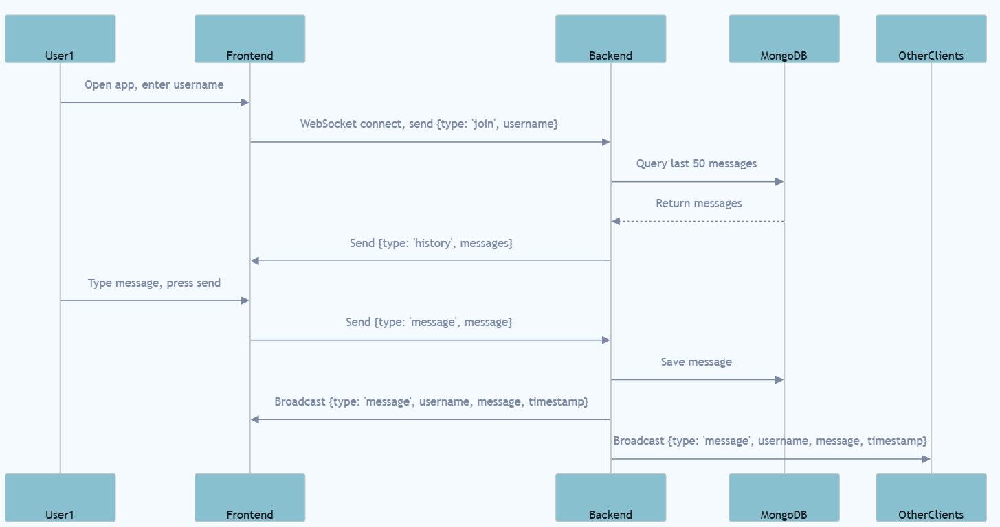

# Real-Time Chat Application (MERN + WebSocket)

A minimalist, professional real-time chatroom using MongoDB, Express, React, Node.js, and the `ws` WebSocket library.

---



---

## 🚀 Features

- **Real-time chat** with multiple users
- **Persistent message history** (last 50 messages)
- **Minimalist, responsive UI** (black with thin purple borders)
- **No Socket.IO** — uses browser WebSocket API and `ws` on backend

---

## 🧑‍💻 Local Setup & Running Instructions

### 1. **Clone the repository**
```bash
git clone <your-repo-url>
cd chat-application
```

### 2. **Backend Setup**
```bash
cd backend
npm install
```
- Create a `.env` file in `/backend` with:
  ```
  MONGODB_URI=your-mongodb-connection-string
  ```
- Start the backend:
  ```bash
  npm start
  ```
- The backend runs on [http://localhost:5000](http://localhost:5000)

### 3. **Frontend Setup**
```bash
cd ../frontend
npm install
npm start
```
- The frontend runs on [http://localhost:3000](http://localhost:3000)
- **Note:** If running locally, ensure `WS_URL` in `src/App.js` is set to `ws://localhost:5000`.

---

## 🏗️ Architecture Overview

### **Tech Stack**
- **Frontend:** React SPA (Single Page Application)
- **Backend:** Node.js, Express.js, WebSocket (`ws`), MongoDB (Mongoose)

### **Frontend-Backend Communication**
- Uses the browser's native WebSocket API to connect to the backend.
- On joining, the frontend sends the username to the backend via WebSocket.
- The backend responds with the last 50 messages (history).
- All chat messages are sent and received in real time via WebSocket.

### **Concurrency Handling**
- The backend uses Node.js's asynchronous I/O and the `ws` library to handle multiple concurrent WebSocket clients efficiently.
- All database operations (message fetch, save) use `async/await` for non-blocking concurrency.
- Each client connection is independent; messages are broadcast to all connected clients.

### **WebSocket Message Flow**
- **Client connects:** Sends `{ type: 'join', username }`.
- **Server responds:** Sends `{ type: 'history', messages: [...] }` (last 50 messages).
- **Client sends message:** `{ type: 'message', message }`.
- **Server broadcasts:** `{ type: 'message', username, message, timestamp }` to all clients.

---

## 💡 Assumptions & Design Choices
- **Single chatroom:** No private rooms or DMs for simplicity.
- **No authentication:** Anyone can join with any username.
- **Message history limited to 50:** For performance and clarity.
- **Minimal dependencies:** Only MERN stack and `ws` for WebSocket.
- **UI:** Minimalist, professional, mobile responsive, with black background and thin purple borders.
- **WebSocket only:** No REST API for chat; all real-time via WebSocket.

---

## 🌐 Accessing the Deployed Application

- **Frontend (Vercel):** [https://chat-application-phi-six.vercel.app](https://chat-application-phi-six.vercel.app)
- **Backend (Render):** [https://chat-application-wm00.onrender.com](https://chat-application-wm00.onrender.com)

**How to use:**
1. Open the frontend URL in your browser.
2. Enter a username and join the chatroom.
3. Start chatting in real time with others!

> **Note:** The frontend is configured to connect to the backend WebSocket at `wss://chat-application-wm00.onrender.com`. If you redeploy, update this URL in `src/App.js` and redeploy the frontend.

---
## 📝 Credits & License
- Built by Piyush Bafna
- MIT License